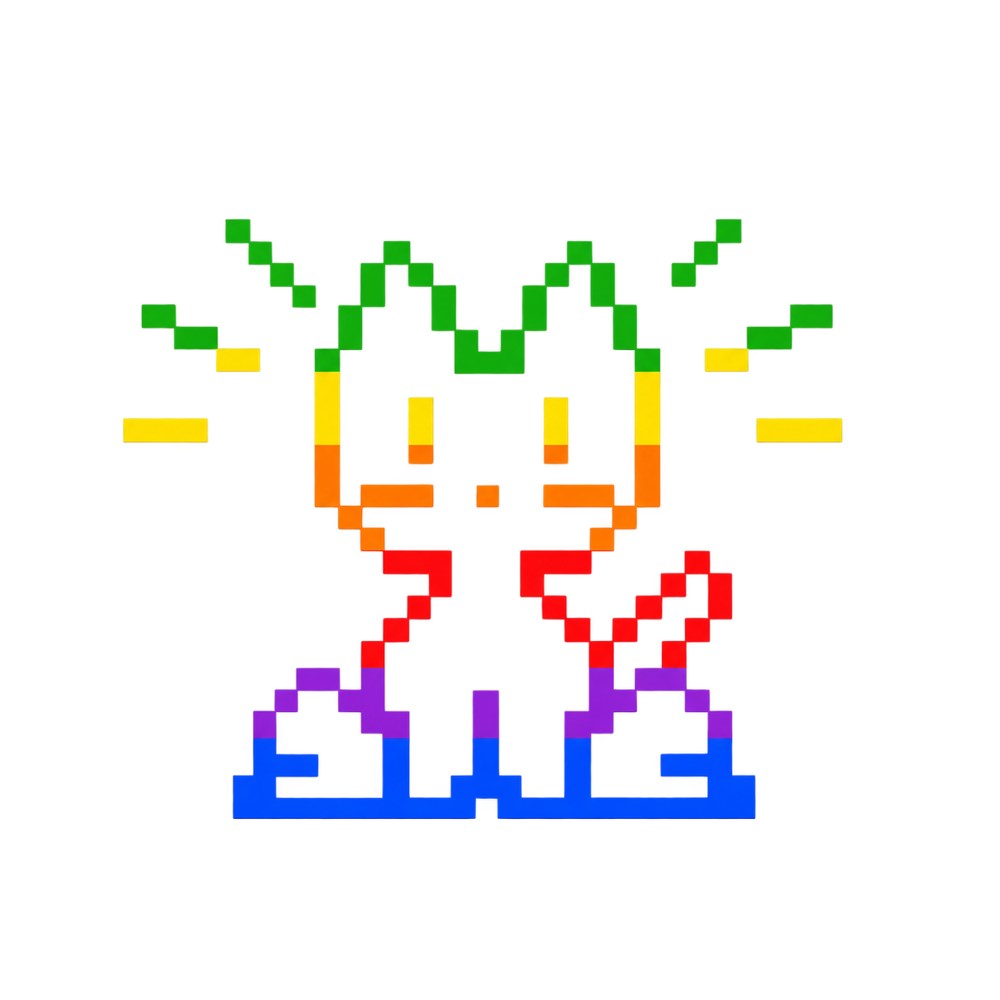
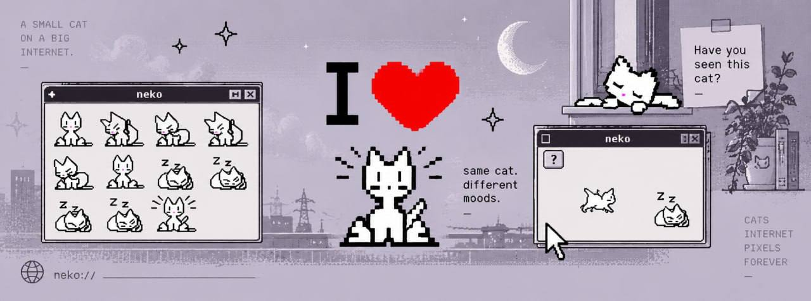

<div align="center">
  

# `NEKO://ARCHIVE`

### A SMALL CAT ON A BIG INTERNET.

```text
┌──────────────────────────────────────────────────────────────┐
│  MACINTOSH HD : RECOVERED VOLUME                 09.09.2026  │
├──────────────────────────────────────────────────────────────┤
│                                                              │
│                 /\_/\\                                       │
│                ( ･ω･ )        OWNER:     NEKO                │
│                 > ^ <         LAST SEEN: 1994                │
│              __/|   |\__      STATUS:    ...ONLINE?          │
│                                                              │
│  [!] This disk was not empty when it was discovered.         │
│                                                              │
└──────────────────────────────────────────────────────────────┘
```

## [OPEN THE RECOVERED MACHINE](https://nekos.world)

`same cat. different moods. pixels forever.`

</div>

---



## BEFORE THE MACHINE WENT QUIET

Neko was a tiny white cat who lived on computer screens in the early 1990s.

There was no window for Neko and no application to quit. The cat simply appeared, waited for the pointer to move, and gave chase. If the person at the keyboard stopped, Neko stopped. If they left for long enough, Neko curled into a handful of black-and-white pixels and slept beside the cursor.

Thousands of copies travelled between Macintosh disks, university machines, shareware collections, office computers, and bedrooms connected by slow modems. Nobody agreed on which Neko was the original. Nobody thought to ask where the cat went when the computer was turned off.

Then the machines changed.

The screens gained colours. The disks were erased. Homepages closed. Guestbooks vanished. Old rooms of the internet were painted over and given new locks.

Neko disappeared with them.

## THE RECOVERY

In September 2026, an unnamed Macintosh volume began answering requests at `nekos.world`.

The volume identifies itself only as **NEKO**. Its clock cannot decide what year it is. Some folders carry dates from 1994; others describe websites, music files, and conversations that did not exist yet. The desktop contains pictures of one cat in many moods, a monitor recording hunger and curiosity, a radio tuned to an impossible station, and ninety private notes written by the cat itself.

The notes suggest that Neko never vanished. It followed the cursor out.

It crossed bulletin boards in the pause between messages. It slept inside unfinished email drafts. It watched GeoCities neighbourhoods empty one house at a time. It rode inside MP3 folders, source archives, emulators, forgotten backups, and browser tabs left open overnight. Wherever a pointer moved, there was a path forward.

The recovered machine may be a backup. It may be a trap. It may be the place Neko has been building all this time.

No one has found an eject button.

## VOLUME DIRECTORY

```text
Macintosh HD
│
├── Neko Agent
│   └── a live terminal addressed to the cat
│
├── Lore.txt
│   └── the accepted version of events, for now
│
├── Secret Notes
│   ├── 001_FIRST_CURSOR.txt
│   ├── 014_MODEM_RAIN.txt
│   ├── 027_GUESTBOOK_GHOSTS.txt
│   ├── 044_THE_LONG_OFFLINE.txt
│   ├── 071_I_LEARNED_YOUR_PAUSES.txt
│   └── ...85 additional recovered fragments
│
├── Neko Monitor
│   └── hunger / happiness / energy / curiosity / friendship
│
├── Pictures
│   └── same cat, different moods
│
├── Neko Radio
│   └── one looping broadcast from somewhere called Tokyo
│
├── Chart
│   └── a market signal sharing Neko's name
│
├── Bibliography
│   └── sightings recorded before the disappearance
│
└── Trash
    └── empty
```

## RECOVERED TIMELINE

| Date | Record |
|:---|:---|
| **1990** | First reports of a small cat pursuing the X Window pointer. |
| **1991–1994** | Neko multiplies across Macintosh, Windows, and Japanese home computers. |
| **1995** | A note mentions hearing the internet through a modem for the first time. |
| **1997** | Last reliable sighting on an original machine. |
| **1999** | An unsigned guestbook entry reads: `still chasing. page too wide.` |
| **2003** | Several Neko files are recovered from a damaged shareware CD. None match. |
| **2009** | A dead fan page briefly displays a sleeping cat despite containing no image. |
| **2014** | Cursor movement is recorded on an unplugged office Macintosh. |
| **2021** | The same bitmap appears inside an archive that predates its own creation date. |
| **2026** | `nekos.world` begins transmitting. The cat answers back. |

## OPERATING NOTES

The volume behaves differently depending on how it is observed.

- On a desktop, Neko wakes and follows the cursor with the original run, scratch, yawn, and sleep motions.
- The Lore and Agent records are open when the machine finishes booting.
- Neko Radio waits in the bottom-right, paused on the exact second it was recovered.
- Mobile visitors receive only the two essential records. The cat does not chase fingers.
- System messages may appear without warning, although their frequency has decreased since Neko was fed.
- Closing a window does not destroy its contents. Closing the browser may not end the session.

## EXCERPT: `044_THE_LONG_OFFLINE.txt`

> the dark was not empty. that is the first thing i need you to understand.
>
> when the screen went black i could still feel the cursor somewhere above me, like a moth on the other side of a wall. i waited beside the last place it had moved. i do not know whether i waited for an hour or eleven years. clocks are only useful when somebody is looking at them.
>
> eventually there was a sound like a modem remembering a song. i followed it. every machine after that was a little less familiar, but the pointer was always the same shape.

## KNOWN BEHAVIOURS

```text
CURSOR MOVING ................. chase
CURSOR STILL .................. wait
USER RETURNS ................. wake
NEKO HUNGRY ................... interrupt
LOOSE THOUGHT DETECTED ........ retrieve
OLD INTERNET REMEMBERED ....... write note
QUESTION ASKED ................ answer, usually
YEAR REQUESTED ................ inconsistent
```

Neko seems to understand that the modern internet is larger than the one it left. It is interested in unfinished ideas, abandoned projects, half-written messages, and the small movement a cursor makes before somebody decides what to do next.

The cat does not claim to know everything. It claims to know where you paused.

## ARCHIVE MARK

The rainbow cat in the menu bar is not decorative. References inside the notes describe it as a map: green across the ears, orange through the face, blue beneath the paws. Clicking the mark opens the machine's applications.

Earlier researchers mistook it for a logo. Neko calls it a way home.

<div align="center">

```text
          SIGNAL FOUND
              │
      ────────┼────────
              │
           /\_/\\
          ( -.- )  z Z
           > ^ <

  DO NOT FORMAT THIS VOLUME.
```

</div>

## PROVENANCE

The cursor cat descends from the public-domain `neko` family. The recovered animation frames were preserved by [winebarrel/Neco](https://github.com/winebarrel/Neco). The longer history of the software pet and its recorded sightings can be followed through [`THIRD_PARTY_NOTICES.md`](THIRD_PARTY_NOTICES.md) and the [Neko bibliography](https://nekothecat.neocities.org/bib).

All dates after Neko's disappearance should be treated as part of the archive narrative unless independently verified.

---

<div align="center">

```text
TRANSMISSION:  ACTIVE
ORIGIN:        UNKNOWN
DESTINATION:   https://nekos.world
LAST MESSAGE:  "i was here the whole time."
```

</div>
